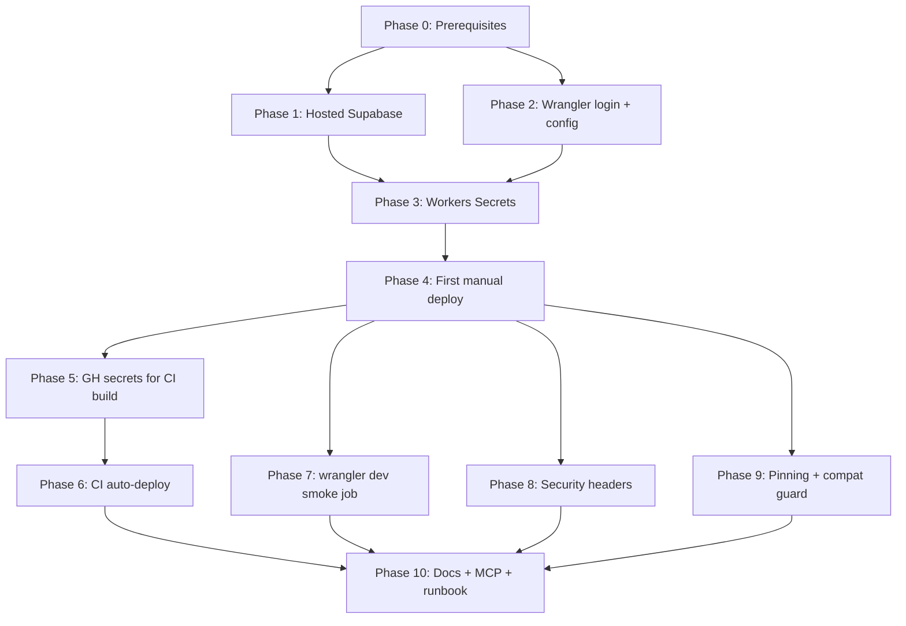
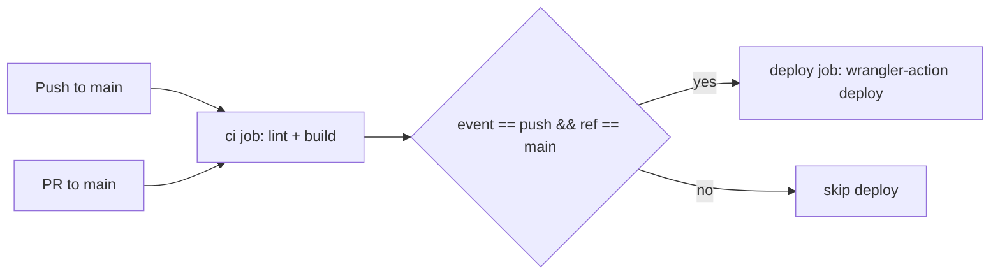

# Cloudflare Workers Deployment Plan — BetCup

Implements the "Getting Started" + Risk Register guidance in [context/foundation/infrastructure.md](../../foundation/infrastructure.md). Track each phase by ticking its checkboxes.

- **Phase 0** — one-time account / tooling prerequisites
- **Phases 1–5** — path to first production deploy
- **Phases 6–10** — hardening that should land before real users touch the Worker

## Known discrepancies to resolve up-front

- **`SUPABASE_KEY` is the anon key, not service-role.** [context/foundation/infrastructure.md](../../foundation/infrastructure.md) line 102 says "service-role values" — but [src/lib/supabase.ts](../../../src/lib/supabase.ts) uses `@supabase/ssr`'s `createServerClient`, which is built for the **anon** key + user session cookies + RLS. Service-role would bypass RLS entirely (FR-015 prediction-blindness invariant would be silently broken). The [README.md](../../../README.md) is correct; the infra doc is wrong. **Use the anon key everywhere** (Workers Secrets, GitHub Secrets, local `.dev.vars`). Fix the infra doc line in Phase 10.
- **`tech-stack.md` says `deployment_target: cloudflare-pages`** but the project ships on Workers (`@astrojs/cloudflare` v13 + `wrangler.jsonc`). Stale hint, non-blocking — also fix in Phase 10.
- **Worker name in [wrangler.jsonc](../../../wrangler.jsonc) is `10x-astro-starter`.** Deploy URL would be `https://10x-astro-starter.<account>.workers.dev`. Rename to `betcup` in Phase 2 before first deploy — renaming **after** deploy creates a stranded Worker on the old name.
- **Default branch is `main`, not `master`.** [.github/workflows/ci.yml](../../../.github/workflows/ci.yml) triggers on `[main]`; `git remote` is `origin/main`. Several docs (AGENTS.md, README.md, infrastructure.md, bootstrap-verification) reference `master` due to starter-template inheritance — this entire plan's text *also* says `master` in several places, but the actual CI trigger and the Phase 6 deploy-job condition both use `main`. Doc cleanup belongs in Phase 10.

## Dependency map

---

## Phase 0 — Prerequisites & account setup

One-time setup. Skip any sub-section you've already completed and just tick the verification checkbox at the bottom. Aim to finish Phase 0 end-to-end in one sitting before starting Phase 1.

### 0.A — Cloudflare account

- [x] Sign up at [dash.cloudflare.com/sign-up](https://dash.cloudflare.com/sign-up) (free tier; no credit card required for Workers Free)
- [x] Verify the account email (sign-up sends a confirmation link)
- [x] Enable Two-Factor Auth: **My Profile → Authentication → Two-Factor Authentication** (deploy access is sensitive; do this before any token is issued)
- [x] Visit **Workers & Pages** in the left nav; on first visit you'll be prompted to **claim a `workers.dev` subdomain** — pick something stable (e.g., `<your-handle>.workers.dev`). Your first Worker will live at `https://betcup.<your-handle>.workers.dev`
- [x] Capture your **Account ID**: open any Worker page (or **Account Home**) → right sidebar → "Account ID" → copy. Stash in a password manager / scratchpad — needed in Phase 6

**Edge cases / extra support**

- **Email already in use** (you signed up years ago and forgot): use password reset rather than creating a new account — wrangler login is keyed to email and a duplicate account will surface a confusing "which account?" choice later.
- **`workers.dev` subdomain prompt didn't appear**: head to **Workers & Pages → Overview → Change** to pick the subdomain manually.
- **Multiple Cloudflare accounts on the same email** (rare — happens when a team invites you): `npx wrangler whoami` (Phase 2) will list all accounts; you'll need to pass `CLOUDFLARE_ACCOUNT_ID` explicitly for every command.

### 0.B — Local toolchain (Node 22 + Wrangler CLI)

The project pins `wrangler` in [package.json](../../../package.json) `devDependencies` (`^4.90.0`). Use it via `npx wrangler` — that's the version CI will also run.

- [x] Install Node 22 (matches [`.nvmrc`](../../../.nvmrc)). Recommended approaches:
  - **nvm (macOS/Linux/WSL):** `nvm install 22 && nvm use 22`
  - **nvm-windows:** `nvm install 22.14.0 && nvm use 22.14.0`
  - **Volta:** `volta install node@22`
  - **Direct installer:** [nodejs.org](https://nodejs.org/) — pick LTS 22.x
- [x] Verify: `node --version` → `v22.x.x`
- [x] Verify: `npm --version` (npm ships with Node)
- [x] If a fresh clone, `npm ci` once at repo root (installs `wrangler` into `node_modules/`)
- [x] Verify: `npx wrangler --version` → reports `wrangler 4.x` (likely `4.94.x` or newer)

**Edge cases / extra support**

- **PowerShell execution policy blocks npx scripts**: `Set-ExecutionPolicy -Scope CurrentUser -ExecutionPolicy RemoteSigned` (one-time, current user only).
- **Corporate proxy / SSL inspection**: set `HTTPS_PROXY` and `NODE_EXTRA_CA_CERTS` env vars before any `npx wrangler` call — wrangler uses Node's HTTPS stack so the same env vars that fix `npm install` fix `wrangler login`.
- **Don't `npm install -g wrangler`** unless you also remove the project pin. Two wrangler versions on PATH leads to silent local-vs-CI drift, which is exactly what Phase 9 fights against.

### 0.C — Wrangler authentication

- [x] `npx wrangler login` — opens a browser tab, prompts you to authorize the CLI against your Cloudflare account
- [x] Approve the OAuth permissions (Workers, KV, R2, etc. — accept the default set)
- [x] Verify: `npx wrangler whoami` → prints your email + a table of accounts you have access to + the Account ID (cross-check against the one from 0.A)
- [x] Test reach: `npx wrangler deployments list --name=betcup` — should error with "Worker not found" (good — proves auth works; nothing deployed yet)

**Edge cases / extra support**

- **`wrangler login` opens browser but auth never completes**: a corporate firewall is blocking the OAuth callback to `localhost`. Workaround: `npx wrangler login --browser=false` and follow the displayed URL on a personal device, then paste back the redirect URL.
- **`Could not find account ID`** on multi-account profiles: export `CLOUDFLARE_ACCOUNT_ID=<id from 0.A>` in your shell (or in [wrangler.jsonc](../../../wrangler.jsonc) as `account_id`).
- **API token already in env** (e.g., `CLOUDFLARE_API_TOKEN` set globally): wrangler prefers it over OAuth, which can silently bypass `wrangler login`. If `whoami` returns unexpected output, `unset CLOUDFLARE_API_TOKEN` and re-run.

### 0.D — Supabase account

Project creation itself is in Phase 1 — this sub-section is just account onboarding.

- [x] Sign up at [supabase.com/sign-up](https://supabase.com/sign-up). GitHub OAuth is the fastest path — no separate password to manage
- [x] Enable Two-Factor Auth at **Account → Security → Two-Factor Authentication**
- [x] (Optional) Create an **Organization** named for the friend pool / your handle — keeps free-tier projects organized if you ever add more

**Edge cases / extra support**

- **Free tier caps:** 2 active projects per organization, 500 MB DB, 50 MAU, pauses after 7 days of inactivity. BetCup easily fits in one project for a 5–20 user friend pool.
- **Auto-pause during off-season**: Supabase pauses projects after 7 days of zero activity. Tournament-driven apps spend months inactive between tournaments — schedule a lightweight cron-ping (e.g., a GH Actions workflow on cron hitting any public Supabase endpoint) during pre-tournament weeks to keep it warm. Resuming a paused project is one click but takes ~1 minute.

### 0.E — GitHub repo prerequisites

The repo already exists at C:/workspace/braveai-prj with [.github/workflows/ci.yml](../../../.github/workflows/ci.yml) and a working `lint + build` pipeline. This sub-section just verifies the access + tooling needed for Phases 5–6.

- [x] Confirm **admin or maintain role** on the GitHub repo (needed to add Actions secrets)
- [x] In repo **Settings → Actions → General**, confirm "Allow all actions and reusable workflows" (or at minimum the `cloudflare/wrangler-action` allowlist for restricted orgs)
- [x] (Optional but recommended) Install the [`gh` CLI](https://cli.github.com/) and `gh auth login` — `gh secret set NAME` is much faster than the dashboard for the 4 secrets Phases 5–6 add
- [x] Verify the existing CI passes today: open the **Actions** tab, confirm the latest `master` run is green (or fix it before adding the deploy job in Phase 6)

**Edge cases / extra support**

- **Org-level Actions restrictions** (you're in a GitHub org): an org admin may have to allowlist `cloudflare/wrangler-action@v3` in **Org Settings → Actions → General → Allowed actions**. Have the allowlist URL ready when asking.
- **Fork-PR builds skip secrets** by GitHub policy. Phase 6's deploy job guards against this with an `if: github.event_name == 'push'` condition.

### 0.F — Sanity check (don't skip)

- [x] Cloudflare account exists, 2FA on, `workers.dev` subdomain claimed, Account ID captured
- [x] `node --version` reports v22.x
- [x] `npx wrangler --version` reports 4.x
- [x] `npx wrangler whoami` prints the expected account
- [x] Supabase account exists, 2FA on
- [x] GitHub repo admin/maintain access confirmed, latest CI run is green

If any of the six is unticked, **stop and resolve before starting Phase 1**. The downstream phases assume all of Phase 0 is done.

---

## Phase 1 — Hosted Supabase project (production)

The deployed Worker cannot talk to `http://127.0.0.1:54321`. A hosted project must exist before Phase 3.

- [x] In the Supabase dashboard, click **New Project** in your organization
- [x] Project name: `betcup-prod`; database password: generate a strong one and stash in a password manager (Supabase will not show it again); region: nearest to the friend group (e.g., `eu-central-1` for an EU pool)
- [x] Wait ~2 minutes for provisioning
- [x] In **Settings → API**, copy `Project URL` and `anon public` key (NOT `service_role`)
- [x] In **Authentication → URL Configuration**, set:
  - `Site URL` = `https://betcup.<your-handle>.workers.dev` (placeholder until Phase 4 confirms the actual subdomain; revisit after first deploy)
  - `Redirect URLs` includes the same origin
- [x] In **Authentication → Sign In / Providers → Email**, decide email-confirmation policy:
  - **Recommended for MVP:** keep "Confirm email" **off** — per [PRD FR-001](../../foundation/prd.md) the admin creates accounts with an initial password and shares it out-of-band; email confirmation breaks that flow
- [x] Save credentials (URL + anon key + DB password) to a password manager — needed in Phase 3 and Phase 5

**Edge cases / extra support**

- **Wrong region picked**: Supabase doesn't support region migration — you have to recreate the project. Pick carefully.
- **`anon` vs `service_role` mix-up**: the keys look almost identical in the dashboard. The `anon` key has `"role":"anon"` in its JWT payload; `service_role` has `"role":"service_role"`. Paste into [jwt.io](https://jwt.io) once to confirm before Phase 3.

---

## Phase 2 — Local Wrangler config sanity

Phase 0.C already covered `wrangler login`. This phase is the project-config side.

- [x] Edit [wrangler.jsonc](../../../wrangler.jsonc): change `"name": "10x-astro-starter"` to `"name": "betcup"`
- [x] Verify [wrangler.jsonc](../../../wrangler.jsonc) still contains:
  - `"compatibility_flags": ["nodejs_compat"]` (required for `@supabase/ssr` — without it, prod 500s)
  - `"compatibility_date": "2026-05-08"` (or later — needed for nodejs polyfill injection)
  - `"observability": { "enabled": true }` (free, enables Workers Logs)
- [x] `npm run build` locally — confirm a clean SSR build artifact lands in `dist/` *(built in 11.97s; one soft warning from `@astrojs/sitemap` about missing `site` option — non-blocking; BetCup is a private app per PRD and likely doesn't need a sitemap. Flagged for follow-up cleanup, out of scope for this plan.)*

**Edge cases / extra support**

- **Renaming the Worker after a deploy strands the old one.** If you already ran `wrangler deploy` with the old name, run `npx wrangler delete --name=10x-astro-starter` to clean up before the rename.
- **`npm run build` fails with a Node module error citing `require`**: most likely a dep that needs CJS — verify `nodejs_compat` is set; if still failing, the dep is genuinely incompatible with workerd (see [astro.build cloudflare adapter docs](https://docs.astro.build/en/guides/integrations-guide/cloudflare/) "Node.js compatibility").

---

## Phase 3 — Workers Secrets (production runtime)

Secrets read via `astro:env/server` at request time. Must be set on the Worker before first deploy — otherwise [src/lib/supabase.ts](../../../src/lib/supabase.ts) `createClient` returns `null` and auth silently no-ops.

- [ ] `npx wrangler secret put SUPABASE_URL` → paste the hosted project URL from Phase 1
- [ ] `npx wrangler secret put SUPABASE_KEY` → paste the **anon** key from Phase 1
- [ ] `npx wrangler secret list` — confirm both names appear (values are not shown)

**Edge cases / extra support**

- Do **not** set these via `vars` in [wrangler.jsonc](../../../wrangler.jsonc) — `vars` are bundled into the deployment metadata and visible to anyone with read access on the Worker. `secret put` stores them encrypted.
- A typo in the URL (e.g., trailing `/`) won't surface until a runtime call. Plan to hit `/auth/signin` immediately after Phase 4's deploy.
- Rotation: `wrangler secret put <NAME>` overwrites in place — no separate delete step. There's no "secret history" — keep prior values in a password manager.
- **`wrangler secret put` errors "Worker not found"**: secrets can't be set on a Worker that doesn't exist yet. Run a one-time `npx wrangler deploy` first (it's fine if it 500s at runtime — the script just needs to exist on Cloudflare so `secret put` has a target), then re-run `secret put`, then `deploy` again.

---

## Phase 4 — First manual deploy + smoke check

- [x] `npm run build`
- [x] `npx wrangler deploy --dry-run` — confirms bundle size is under the limit (3 MB Free / 10 MB Paid, **compressed**) without actually deploying *(391 KiB gzip / 1913 KiB raw; well under the 3 MB Free ceiling)*
- [x] `npx wrangler deploy` — pushes to `https://betcup.betcup.workers.dev`
- [x] Confirmed via WebFetch: `/dashboard` redirects to `/auth/signin`; signin page renders SSR + Astro Islands hydration script; no 500s
- [ ] Create one test user via the hosted Supabase dashboard (Authentication → Users → Add user), sign in via `/auth/signin`, confirm `/dashboard` loads *(manual — recommended but does not block CI work)*
- [ ] In DevTools → Application → Cookies, verify Supabase session cookies have **`HttpOnly`** and **`Secure`** flags set (defaults from `@supabase/ssr`, but verify — see Phase 8) *(manual)*
- [ ] Update Supabase **Site URL** + **Redirect URLs** from the Phase 1 placeholder to `https://betcup.betcup.workers.dev` *(manual — required for any auth flow that issues a redirect URL, e.g., password reset)*
- [x] Diagnostics path documented: `npx wrangler tail betcup` for live logs if anything 500s

**Edge cases / extra support**

- **`workers.dev` subdomain not enabled**: if `wrangler deploy` succeeds but the URL 404s, head back to 0.A and claim the subdomain.
- **Bundle exceeds 3 MB compressed**: tree-shake suspects first (full `date-fns` import, full lucide-react import). If genuinely over, upgrade to Workers Paid ($5/mo) for the 10 MB ceiling.
- **`nodejs_compat` cryptic 500**: if the build deploys but auth 500s with no clear stack trace, re-verify Phase 2 — the flag was likely dropped during an edit.
- Update Supabase **Site URL** (Phase 1) to the now-confirmed real `workers.dev` subdomain.

---

## Phase 5 — GitHub repo secrets for CI build

Existing [.github/workflows/ci.yml](../../../.github/workflows/ci.yml) already consumes `SUPABASE_URL`/`SUPABASE_KEY` in the build step but currently fails silently if missing (Astro's envField is `optional: true` per [astro.config.mjs](../../../astro.config.mjs)).

- [ ] In GitHub repo → **Settings → Secrets and variables → Actions → New repository secret**:
  - `SUPABASE_URL` (same hosted URL as Phase 3)
  - `SUPABASE_KEY` (same anon key as Phase 3)
- [ ] Re-run the latest CI workflow — confirm lint + build pass with secrets injected

**Edge cases / extra support**

- Fork-PR builds intentionally do **not** receive secrets (GitHub policy). The build still passes because envFields are `optional: true` — but auth will be no-op at runtime in a fork-PR-built artifact. This is acceptable; never auto-deploy fork-PR builds (Phase 6 guard covers this).
- If using `gh` CLI: `gh secret set SUPABASE_URL --body "https://..."` and `gh secret set SUPABASE_KEY` (interactive prompt).

---

## Phase 6 — CI auto-deploy on push to main

Extends [.github/workflows/ci.yml](../../../.github/workflows/ci.yml) with a `deploy` job that runs only after `lint + build` succeeds on a push to `main`. Manual `npx wrangler deploy` remains the escape hatch for hotfixes and rollbacks.

- [ ] In Cloudflare dash → **My Profile → API Tokens → Create Token**, use the **"Edit Cloudflare Workers"** template (scoped to your account + the `betcup` Worker)
- [ ] Add GitHub repo secrets:
  - `CLOUDFLARE_API_TOKEN` (from the token just created)
  - `CLOUDFLARE_ACCOUNT_ID` (from `wrangler whoami` in 0.C)
- [x] Add a `deploy` job to [.github/workflows/ci.yml](../../../.github/workflows/ci.yml):
  - `needs: ci`
  - `if: github.event_name == 'push' && github.ref == 'refs/heads/main'`
  - Uses `cloudflare/wrangler-action@v3` (pinned to v3 major; auto-picks up v3.x patches)
  - `command: deploy` (runs `wrangler deploy` against the freshly-built `dist/`)
  - Re-checkout + re-install + re-build inside the deploy job (artifacts don't carry between jobs by default — simpler than wiring `actions/upload-artifact`)
  - Passes `SUPABASE_URL` + `SUPABASE_KEY` env to the build step (CI build still needs them)
- [x] Add `concurrency: { group: deploy-prod, cancel-in-progress: false }` to the deploy job — serializes rapid merges so they don't race
- [ ] Trigger by pushing a commit to main; verify the deploy job runs and the Worker version increments in `npx wrangler deployments list`

**Edge cases / extra support**

- **Token scope too narrow**: if the deploy fails with `Authentication error [code 10000]`, the token likely lacks the Worker Scripts:Edit permission. Recreate from the template.
- **Wrangler version drift between local and CI**: pin `wrangler-action` to a minor; the action installs `wrangler` from the project's `package.json` by default, so the project-pinned version is what runs.
- **Rollback runbook for CI deploys**: `npx wrangler rollback` (run locally) reverts to the previous version in seconds. Documented in Phase 10.

---

## Phase 7 — Wrangler-dev runtime-parity smoke test in CI

The pre-mortem in [context/foundation/infrastructure.md](../../foundation/infrastructure.md) calls out that `astro dev` (even on Astro 6's workerd-backed plugin) is not the same artifact as the deployed bundle. This phase adds a CI job that exercises the **built** `dist/` against `wrangler dev` and curls a few critical routes.

- [x] Add a `smoke` job to [.github/workflows/ci.yml](../../../.github/workflows/ci.yml) that:
  - `needs: ci`
  - Materializes `.dev.vars` from `SUPABASE_URL` + `SUPABASE_KEY` GH secrets (fork PRs without secrets are tolerated — middleware degrades to "no Supabase client" → still redirects unauthenticated `/dashboard`)
  - Boots `npx wrangler dev --port 8788 --ip 127.0.0.1` in the background with output captured to `wrangler-dev.log`
  - Waits up to 60s for `/auth/signin` to respond 200 (`curl -sf` loop), dumps the log if it never comes up
  - Asserts `/auth/signin` → 200 and `/dashboard` → 302 (proves [src/middleware.ts](../../../src/middleware.ts) `PROTECTED_ROUTES` runs against the build artifact, not the source)
  - Cleans up via `trap "kill $WRANGLER_PID" EXIT`
- [x] `deploy` job in Phase 6 also `needs: [ci, smoke]` — smoke must pass before auto-deploy fires

**Edge cases / extra support**

- `wrangler dev` in CI needs the same `.dev.vars` shape — write a step that materializes a CI-only `.dev.vars` from GH secrets (or pass `--var SUPABASE_URL=... --var SUPABASE_KEY=...`).
- workerd doesn't fully support all Node APIs even with `nodejs_compat`. If a real Supabase auth call fails only here, mock Supabase for the smoke test (point `SUPABASE_URL` at a tiny mock server in the CI job).

---

## Phase 8 — Security headers in code (SSR responses)

The Risk Register flags that `public/_headers` does **not** apply to SSR responses on `@astrojs/cloudflare` v13 — only static assets. Auth cookies' `Secure`/`HttpOnly` flags come from `@supabase/ssr` defaults but must be verified, and CSP/HSTS/X-Frame-Options need to be set in code.

- [x] In [src/middleware.ts](../../../src/middleware.ts), set baseline headers on every response after `next()`:
  - `Strict-Transport-Security: max-age=63072000; includeSubDomains; preload`
  - `X-Content-Type-Options: nosniff`
  - `X-Frame-Options: DENY` (BetCup has no embed use case)
  - `Referrer-Policy: strict-origin-when-cross-origin`
  - A conservative `Content-Security-Policy` (`default-src 'self'`; `script-src 'self' 'unsafe-inline'` for Astro Islands hydration; `connect-src 'self' https://*.supabase.co` for Supabase Auth XHR; `frame-ancestors 'none'`; `form-action 'self'`; etc.)
- [ ] After next deploy (Phase 6 auto-deploy or manual `wrangler deploy`), inspect response headers in DevTools → Network *(manual)*
- [ ] Run [securityheaders.com](https://securityheaders.com) against `https://betcup.betcup.workers.dev` — target A or better *(manual)*

**Edge cases / extra support**

- React hydration may require `'unsafe-inline'` for scripts initially; the long-term fix is a nonce-based CSP — out of scope for MVP.
- Supabase auth cookies are set by `@supabase/ssr`'s `setAll` callback in [src/lib/supabase.ts](../../../src/lib/supabase.ts); the cookie options default to `httpOnly: true`, `secure: true`, `sameSite: 'lax'` in production — verify via DevTools, don't assume.

---

## Phase 9 — Dependency pinning + compat-flag guard

Risk Register: "Wrangler version pinning matters more than docs admit." A subtle bump can shift `nodejs_compat` semantics or env-resolution behavior.

- [x] In [package.json](../../../package.json), pin `wrangler` from `^4.90.0` → `~4.90.0` (lock minor)
- [x] Add a pre-commit guard via lint-staged that runs `npm run check:wrangler` whenever [wrangler.jsonc](../../../wrangler.jsonc) is staged. Implementation: [scripts/check-wrangler-compat.mjs](../../../scripts/check-wrangler-compat.mjs) — cross-platform Node check (no grep dependency), exits 1 with a descriptive error if `nodejs_compat` is missing
- [x] Wire the same `npm run check:wrangler` as a CI step in [.github/workflows/ci.yml](../../../.github/workflows/ci.yml) — catches `git commit --no-verify` bypasses of husky
- [x] Set `engines.node` in [package.json](../../../package.json) to `>=22.14.0 <23.0.0` (matches [.nvmrc](../../../.nvmrc))

**Edge cases / extra support**

- Renovate/Dependabot will still propose wrangler minor bumps — that's fine; intentional bumps via PR is the goal. Block automated merges on PRs that touch `wrangler` or [wrangler.jsonc](../../../wrangler.jsonc) — require human review.

---

## Phase 10 — Docs, runbook, observability wiring

- [x] Update [context/foundation/infrastructure.md](../../foundation/infrastructure.md): fixed service-role/anon line + 3 `master`→`main` references
- [x] Update [context/foundation/tech-stack.md](../../foundation/tech-stack.md) `deployment_target` from `cloudflare-pages` to `cloudflare-workers`
- [x] Update [README.md](../../../README.md) Deployment section: full rewrite covering worker name, manual deploy, auto deploy, rollback, and CI secrets table
- [x] Update [AGENTS.md](../../../AGENTS.md) with:
  - Rollback runbook (`wrangler deployments list` / `rollback`)
  - Manual approval gates (never autonomous)
  - `check:wrangler` script note
  - `main` not `master` everywhere
  - MCP-server note + `engines.node` reference
- [x] Wire [.cursor/mcp.json](../../../.cursor/mcp.json) with:
  - [Cloudflare docs MCP](https://docs.mcp.cloudflare.com/mcp) — read-only docs access for the agent
  - [Workers Observability MCP](https://observability.mcp.cloudflare.com/mcp) — read-only structured log search; OAuths against your CF account on first use
- [ ] Confirm `npx wrangler tail betcup` streams live logs on demand *(quick manual check)*

**Edge cases / extra support**

- The Workers Observability MCP requires the Worker to have `observability.enabled: true` in [wrangler.jsonc](../../../wrangler.jsonc) — already set, but flag if you ever clone the config.
- Document explicitly in [AGENTS.md](../../../AGENTS.md) the manual-approval gates from infra doc line 81: rotating SUPABASE_KEY, dropping a Supabase table, destructive Supabase migrations, wrangler major-version upgrades, compat-flag changes. These should never be done autonomously by an agent.

---

## Verification: green-light to call this done

- [x] Production Worker reachable at `https://betcup.betcup.workers.dev`
- [ ] Sign-in flow against hosted Supabase works end-to-end *(manual smoke pending: create test user + sign in)*
- [ ] Push to `main` triggers an auto-deploy; PR pushes do not
- [ ] `securityheaders.com` returns A or better
- [ ] `npx wrangler deployments list` shows a clean version history
- [ ] All four "Known discrepancies to resolve up-front" items are closed
